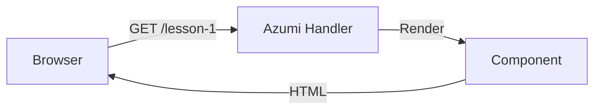

# Understanding Azumi Data Flow: From Stateless to Context-Aware

You asked a great question: **"Why do we need all this middleware stuff now when everything worked fine before?"**

This document explains the architectural shift from "Static Pages" to "Dynamic, User-Aware Applications".

## 1. The "Before" Times: Stateless Handlers

In lessons 0-18, we were building **Stateless Pages**.
When a user asked for `/lesson-1`, we returned the exact same HTML, regardless of who requested it.

**The Flow:**


```mermaid
graph LR
    User[Browser] -->|GET /lesson-1| Handler[Azumi Handler]
    Handler -->|Render| Component[Component]
    Component -->|HTML| User
```

**The Code:**

```rust
// We don't need any arguments because the output is always the same!
pub async fn handler() -> impl IntoResponse {
    azumi::render(&MyComponent())
}
```

**Why it worked:** We didn't need to know _who_ the user was. We just needed to know _what page_ they wanted.

---

## 2. The "Now" Times: Context-Aware Applications

Authentication introduces **Context**.
Now, when a user asks for `/lesson-19`, the response **depends on who they are**.

-   Are they logged in? -> Show "Welcome, Dracon!"
-   Are they a guest? -> Show "Please Login"

We need to inspect the "Context" (Cookies, Headers) of the request.

### Option A: The "Brute Force" Way (Bad)

We _could_ write the check inside every single handler.

```rust
// ❌ BAD: Repetitive and error-prone
pub async fn handler(headers: HeaderMap) -> impl IntoResponse {
    let user = if let Some(cookie) = headers.get("session") {
        verify_cookie(cookie) // <--- Logic repeated in every handler
    } else {
        None
    };
    // ...
}
```

This is what we want to avoid. If we change how auth works (e.g., switch to JWT), we have to rewrite every page.

### Option B: The Middleware Way (The Standard)

We move the "Security Guard" logic out of the handler and into a **Middleware Layer** that runs before the handler.

**The Flow:**

```mermaid
graph LR
    User[Browser] -->|GET /dashboard| Middleware[Auth Middleware]
    Middleware -->|Pass (User Found)| Handler[Azumi Handler]
    Middleware --x|Block (No Cookie)| Login[Redirect to Login]
    Handler -->|Render with User| Component
```

1.  **Middleware**: Checks ID card (Cookie). If valid, it clips a `User` badge (Extension) onto the request.
2.  **Handler**: Doesn't check ID. Just looks for the `User` badge.

---

## 3. The "Bridge": How Data Gets to the UI

This is where your question lies: **"How do we get data from that Middleware into our Component?"**

### Phase 1: Manual Extraction (Verbose)

This is what we did initially in Lesson 19. We explicitly asked Axum for the "Extension" the middleware added.

```rust
// 😐 VERBOSE: functionality is correct, but code is messy
pub async fn handler(
    Extension(user): Extension<User> // <--- "Give me the badge"
) -> impl IntoResponse {
    let state = AuthState { user };
    // ...
}
```

### Phase 2: Automatic Extraction (The "Best Way")

This is what we refactored to. We tell Rust: _"Hey, if a handler asks for a `CurrentUser`, just go find that Extension automatically."_

This allows our Handler to look almost as simple as the "Before Times", but with the power of the "Now Times".

```rust
// ✨ CLEAN: effectively "Automatic"
pub async fn handler(
    user: CurrentUser // <--- "I need the user." (Bridge happens hidden away)
) -> impl IntoResponse {
    // ...
}
```

## Summary

| Feature           | "Before" (Lessons 1-18) | "Now" (Lesson 19)                  |
| :---------------- | :---------------------- | :--------------------------------- |
| **Logic**         | "Show Page X"           | "Show Page X **for User Y**"       |
| **Complexity**    | Zero (Stateless)        | Low (Context-Aware)                |
| **Why Change?**   | N/A                     | We need to know **who** is asking. |
| **Best Practice** | `fn handler()`          | `fn handler(user: CurrentUser)`    |

**Conclusion:**
You weren't "ignoring" middleware before; you just didn't have any middleware running! Now that we added security features, we need a clean way to pipe that security context into your UI. The `CurrentUser` pattern is the cleanest pipe available.
